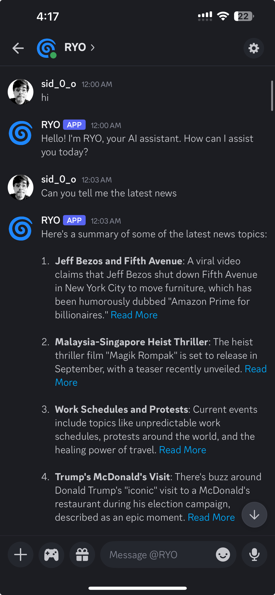

# 🌀 RYO : Work in balance. Life in flow.

A hierarchical multi-agent discord bot for helping promote work-life balance.

## 🧠 Overview
RYO is your autonomous life-balance partner that protects personal time from work chaos while actively tracking fitness, meal prep, news, and goals—ensuring you thrive in both short-term wins and long-term dreams. It automates the mundane (grocery restocking, workout scheduling) and curates the meaningful (personalized news, progress nudges), so your life flows beyond the 9-to-5 grind.

## 🤖 What can this Bot Do?

#### Unlike existing AI Agents where you need to engage it. This agent will engage you. Are you ready? 😎🔥
🎯 Set and Track General Goals and RYO will help you engage in it and track it. 
🥗 Meal Prep with finesse and ease using RYO's recipies and food inventory management.  
💪 Track Gym Goals and be on top of using RYO's weekly routine. 
🗞️ Stay informed of the current events with RYO's personalized news headlines. 
📅 Based on the upcoming events set smart reminders with recommendations to include in your daily schedule. 
🕒 These agents of RYO will work together to adjust to your changing schedules. 

#### Let RYO manage and track your personal goals and flow through life while being organized and stress free!

## 🚀 Current Status
Work in progress: shooting for a beta in 6 months.

### Completed Tasks
✅ Testing LLM Components - LLM Local Connection, Tools  
✅ Setting up discord bot and connecting to local environment via API  
✅ Testing End-to-End integration User ↔️ Discord Bot (Connecting Locally to LLMs)  
✅ Short Term and Long Term Memory established  

### Ongoing Tasks
⚙️ Delete Memories and Reminders once done  
⚙️ Working on Pinging Components  
⚙️ Formalizing Design  
⚙️ Finalizing Features  
⚙️ Developing and Optimizing Features  
⚙️ Strategizing Evaluation  

### TBD
⏳ Commence Full Development  
⏳ Finish Production  
⏳ Estimate Costs  
⏳ Find Beta Testers  
⏳ Evaluate Customer Feedback and Satisfaction  
⏳ Get Testimonials  

