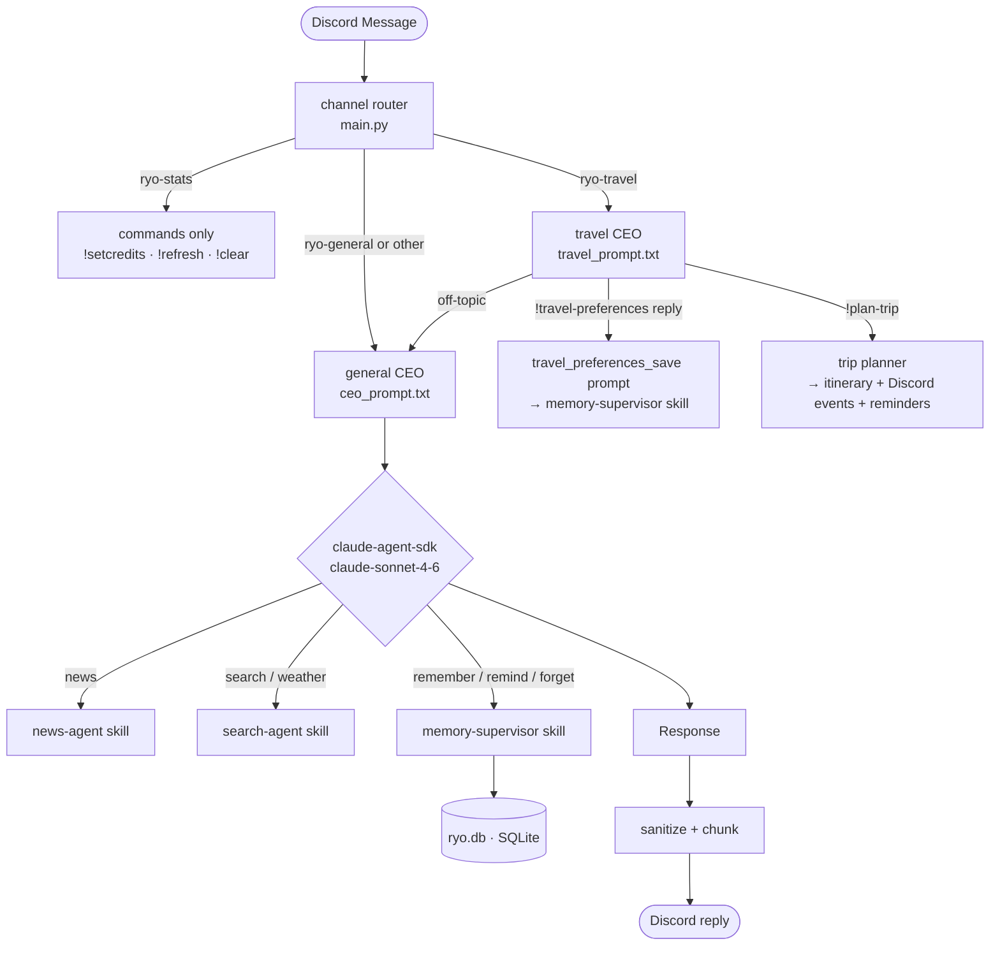
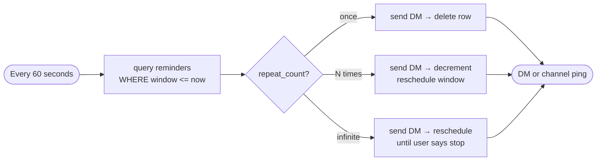
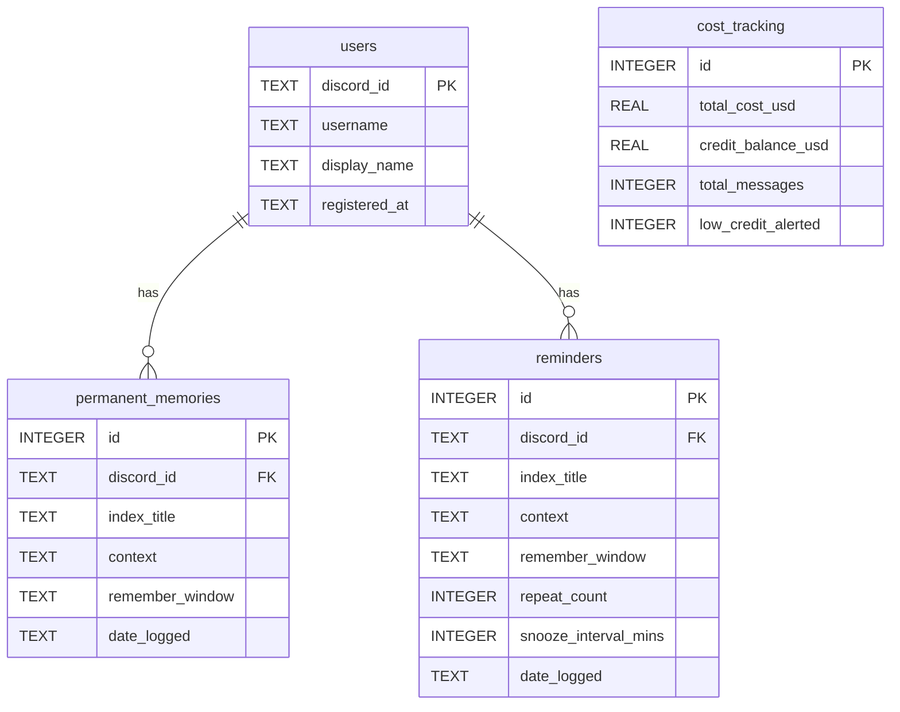

# 🌀 RYO — Work in Balance. Life in Flow.

> **Your AI co-pilot, living inside Discord.**

RYO is a multi-agent Discord bot powered by Claude that keeps you informed, remembers what matters, plans your trips, and pings you before things slip — all through plain conversation in your server.

---

## What RYO Does

**💬 Just talk naturally.** No slash commands, no syntax. Ask in plain English — RYO figures out what you need.

**🧠 Remembers you.** Every user gets their own isolated memory. Tell RYO something once and it uses it forever.

**⏰ Chases you.** Reminders come to you — in DMs or your channel — on a schedule you define.

**✈️ Plans your travel.** Dedicated travel channel with your personal preferences profile built in.

**📊 Tracks its own cost.** Live credit dashboard so you always know what's being spent.

---

## Channels

RYO routes conversations by channel — each one has a focused purpose.

| Channel | Purpose |
|---|---|
| `#ryo-general` | News, web search, weather, memory, reminders — everything |
| `#ryo-travel` | Trip itineraries and travel planning only |
| `#ryo-stats` | Live cost and credit dashboard |

Off-topic messages in a specialised channel are automatically redirected and answered in `#ryo-general`.

---

## Capabilities

**In `#ryo-general`:**
- 📰 **News** — *"What's in the news?"* — fetches live headlines
- 🔍 **Web search** — *"Look up X"* / *"Find info on Y"*
- 🌤️ **Weather** — *"What's the weather in Tokyo?"* — always in Celsius
- 🧠 **Remember** — *"Remember I'm a VP at JPMorgan"*
- 🗑️ **Forget** — *"Forget my address"*
- ⏰ **Reminders** — *"Remind me at 3pm"* / *"Remind me 3 times every 10 minutes"* / *"Keep reminding me until I say stop"*
- 📸 **Images & PDFs** — attach a file and ask a question — Ryo can analyse it

**In `#ryo-travel`:**
- 🗺️ Full day-by-day itineraries with hotels, food, and budget breakdown
- 🎒 Personalised to your travel profile (card type, cuisine, driving, budget style)
- 📅 Creates Discord Scheduled Events for each day of the trip
- ⏰ Automatically sets pre-trip reminders (7 days, 2 days, 1 day before departure)
- 📸 **Images & PDFs** — attach a file and ask a question — Ryo can analyse it

---

## Commands

### `#ryo-general`

| Command | What it does |
|---|---|
| 🔒 `!clear` | Delete all RYO messages in this channel *(owner only)* |

### `#ryo-travel`

| Command | What it does |
|---|---|
| `!travel-preferences` | View or set up your travel profile |
| `!travel-preferences update` | Update your saved travel preferences |
| `!plan-trip <destination> <start YYYY-MM-DD> <end YYYY-MM-DD>` | Generate full itinerary + Discord events + reminders |
| 🔒 `!clear` | Delete all messages in this channel *(owner only)* |

### `#ryo-stats`

| Command | What it does |
|---|---|
| `!refresh` | Force-refresh the credits dashboard |
| 🔒 `!setcredits <amount>` | Set your current credit balance *(owner only)* |
| 🔒 `!clear` | Delete all messages in this channel *(owner only)* |

> Commands are channel-scoped — `!setcredits` only works in `#ryo-stats`, travel commands only in `#ryo-travel`, etc.

---

## Cost Dashboard

`#ryo-stats` shows a live embed that updates after every message:

- Credit bar with % remaining (green → yellow → red as balance drops)
- Remaining vs. consumed breakdown
- Direct link to billing page
- Low-credit DM alert when balance drops below $5

---

## Architecture

### Channel Routing


```mermaid
flowchart TD
    A([Discord Message]) --> B[channel router\nmain.py]

    B -->|ryo-stats| C[commands only\n!setcredits · !refresh · !clear]
    B -->|ryo-travel| D[travel CEO\ntravel_prompt.txt]
    B -->|ryo-general or other| E[general CEO\nceo_prompt.txt]

    D -->|off-topic| E
    D -->|!travel-preferences reply| F[travel_preferences_save prompt\n→ memory-supervisor skill]
    D -->|!plan-trip| G[trip planner\n→ itinerary + Discord events + reminders]

    E --> H{claude-agent-sdk\nclaude-sonnet-4-6}
    H -->|news| I[news-agent skill]
    H -->|search / weather| J[search-agent skill]
    H -->|remember / remind / forget| K[memory-supervisor skill]
    K --> L[(ryo.db · SQLite)]

    H --> M[Response]
    M --> N[sanitize + chunk]
    N --> O([Discord reply])
```

### Proactive Reminder Loop


```mermaid
flowchart LR
    T([Every 60 seconds]) --> Q[query reminders\nWHERE window <= now]
    Q --> R{repeat_count?}
    R -->|once| S[send DM → delete row]
    R -->|N times| U[send DM → decrement\nreschedule window]
    R -->|infinite| V[send DM → reschedule\nuntil user says stop]
    S & U & V --> W([DM or channel ping])
```

### Memory Model


```mermaid
erDiagram
    users {
        TEXT discord_id PK
        TEXT username
        TEXT display_name
        TEXT registered_at
    }
    permanent_memories {
        INTEGER id PK
        TEXT discord_id FK
        TEXT index_title
        TEXT context
        TEXT remember_window
        TEXT date_logged
    }
    reminders {
        INTEGER id PK
        TEXT discord_id FK
        TEXT index_title
        TEXT context
        TEXT remember_window
        INTEGER repeat_count
        INTEGER snooze_interval_mins
        TEXT date_logged
    }
    cost_tracking {
        INTEGER id PK
        REAL total_cost_usd
        REAL credit_balance_usd
        INTEGER total_messages
        INTEGER low_credit_alerted
    }
    users ||--o{ permanent_memories : has
    users ||--o{ reminders : has
```

---

## Skills

Built on the **Claude Agent SDK** with filesystem-based skills loaded on-demand.

```
.claude/skills/
├── news-agent/SKILL.md
├── search-agent/SKILL.md
├── memory-supervisor/SKILL.md
├── memory-store/
│   ├── SKILL.md
│   └── scripts/store_memory.py
└── memory-delete/
    ├── SKILL.md
    └── scripts/delete_memory.py
```

---

## Setup

### 1. Environment

```bash
conda activate llm_env
pip install -r requirements.txt
```

### 2. `.env`

```
ANTHROPIC_API_KEY=""       # console.anthropic.com
OPENWEATHERMAP_API_KEY=""  # openweathermap.org
DISCORD_TOKEN=""           # discord.com/developers
OWNER_DISCORD_ID=""        # your Discord user ID
```

### 3. Database

```bash
python memory/setup_db.py
```

Safe to re-run — creates tables if missing, migrates existing CSV data.

### 4. Run

```bash
python main.py
```

RYO auto-creates `#ryo-stats`, `#ryo-travel`, and `#ryo-general` channels on first start if they don't exist.

---

## Oracle Cloud Deployment

RYO runs 24/7 on Oracle Cloud (Ubuntu). Deploy scripts in `deploy/`:

```
deploy/
├── setup.sh                 ← one-shot provisioning
├── ryo.service              ← systemd unit (auto-start on reboot)
└── requirements-server.txt
```

**Fresh instance:**
```bash
bash deploy/setup.sh
```

**Push an update:**
```bash
git push
ssh ubuntu@<ip> "cd /home/ubuntu/Ryo && git pull && sudo systemctl restart ryo"
```

**Logs:**
```bash
sudo journalctl -u ryo -f
```
