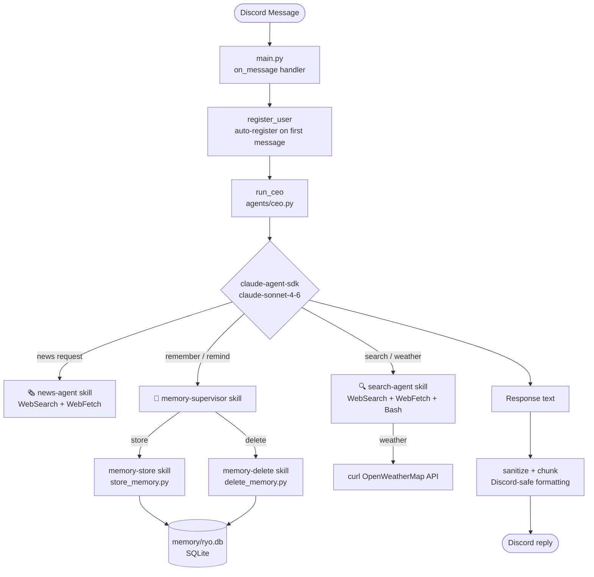
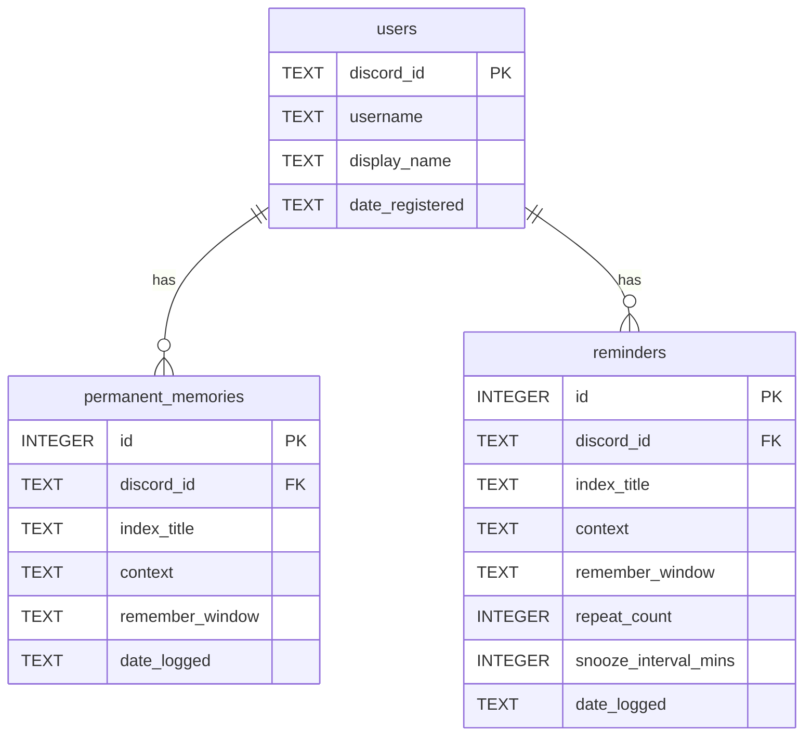

# 🌀 RYO — Work in Balance. Life in Flow.

> **Unlike other AI assistants where you go to them — RYO comes to you.** 😎🔥

RYO is your autonomous life-balance partner living right inside Discord. It protects your personal time from work chaos, keeps you informed, remembers what matters, and proactively pings you before life slips through the cracks — all without you lifting a finger.

---

## ✨ Why RYO?

Most AI tools wait to be asked. RYO doesn't.

- 🗞️ **Stay informed** — get personalized news headlines without doomscrolling
- 🧠 **Never forget** — RYO remembers your context so you don't have to repeat yourself
- ⏰ **Be proactive** — set smart reminders that chase *you*, not the other way around
- 🌤️ **Stay prepared** — instant weather for any city before you step out
- 💬 **Just talk naturally** — no commands, no syntax, just plain English in your Discord server

---

## 🤖 What RYO Can Do Today

| Capability | Example |
|---|---|
| 📰 **Personalized news** | *"What's in the news?"* — tailored to your saved preferences |
| 🔍 **Web search** | *"Find me info on X"* / *"Look up Y"* |
| 🌤️ **Weather** | *"What's the weather in Jersey City?"* |
| 🧠 **Permanent memory** | *"Remember that I'm a VP at JPMorgan"* |
| ⏰ **Reminders** | *"Remind me to submit my report by Friday"* |
| 🔁 **Repeat reminders** | *"Remind me 3 times every 10 minutes"* / *"Keep reminding me until I say stop"* |
| 👤 **Per-user profiles** | Each Discord user gets their own isolated memory and preferences |
| 🗑️ **Forget** | *"Forget my address"* / *"Stop reminding me about X"* |

---

## 🚀 Coming Soon

RYO is growing into a full life-management co-pilot:

- 🎯 **Goal tracking** — set fitness, career, and personal goals; RYO nudges you on progress
- 🥗 **Meal prep** — smart recipes and food inventory management
- 💪 **Gym routine** — weekly workout tracking with adaptive scheduling
- 📅 **Daily briefings** — proactive morning summaries tailored to your day
- 🌐 **Full beta release** — polished, invite-ready for your whole server

---

## 🏗️ Architecture

### Request Flow


```mermaid
flowchart TD
    A([Discord Message]) --> B[main.py\non_message handler]
    B --> C[register_user\nauto-register on first message]
    C --> D[run_ceo\nagents/ceo.py]
    D --> E{claude-agent-sdk\nclaude-sonnet-4-6}

    E -->|news request| F[🗞️ news-agent skill\nWebSearch + WebFetch]
    E -->|search / weather| G[🔍 search-agent skill\nWebSearch + WebFetch + Bash]
    E -->|remember / remind| H[🧠 memory-supervisor skill]
    H -->|store| I[memory-store skill\nstore_memory.py]
    H -->|delete| J[memory-delete skill\ndelete_memory.py]

    I --> K[(memory/ryo.db\nSQLite)]
    J --> K
    G -->|weather| L[curl OpenWeatherMap API]

    E --> M[Response text]
    M --> N[sanitize + chunk\nDiscord-safe formatting]
    N --> O([Discord reply])
```

### Proactive Reminder Loop


```mermaid
flowchart LR
    T([Every 60 seconds]) --> Q[query reminders\nWHERE window <= now]
    Q --> R{repeat_count?}
    R -->|once| S[send DM → delete row]
    R -->|N times| U[send DM → decrement\nreschedule window]
    R -->|infinite| V[send DM → reschedule\nuntil user says stop]
    S --> W([DM or channel ping])
    U --> W
    V --> W
```

### Memory Model


```mermaid
erDiagram
    users {
        TEXT discord_id PK
        TEXT username
        TEXT display_name
        TEXT date_registered
    }
    permanent_memories {
        INTEGER id PK
        TEXT discord_id FK
        TEXT index_title
        TEXT context
        TEXT remember_window
        TEXT date_logged
    }
    reminders {
        INTEGER id PK
        TEXT discord_id FK
        TEXT index_title
        TEXT context
        TEXT remember_window
        INTEGER repeat_count
        INTEGER snooze_interval_mins
        TEXT date_logged
    }
    users ||--o{ permanent_memories : has
    users ||--o{ reminders : has
```

---

## 🧩 Skill Layout

RYO is built on the **Claude Agent SDK** with filesystem-based Agent Skills — each skill is a directory that Claude loads on-demand, keeping context lean and responses fast.

```
.claude/skills/
├── news-agent/SKILL.md          ← headlines + links, 5-7 items
├── search-agent/SKILL.md        ← web facts + weather card
├── memory-supervisor/SKILL.md   ← routes store vs delete, asks repeat preference
├── memory-store/
│   ├── SKILL.md
│   └── scripts/store_memory.py  ← SQLite INSERT with repeat/snooze support
└── memory-delete/
    ├── SKILL.md
    └── scripts/delete_memory.py ← SQLite DELETE scoped to discord_id
```

---

## ⚙️ Setup

### 1. Environment

```bash
conda activate llm_env
pip install -r requirements.txt
```

### 2. `.env`

```
ANTHROPIC_API_KEY=""        # console.anthropic.com (or leave blank if using Claude Code auth)
OPENWEATHERMAP_API_KEY=""   # openweathermap.org
DISCORD_TOKEN=""            # discord.com/developers
```

### 3. Database

```bash
python memory/setup_db.py
```

Safe to re-run — creates tables if missing and migrates any existing CSV data.

### 4. Run

```bash
python main.py
```

---

## ☁️ Oracle Cloud Deployment

RYO runs 24/7 on Oracle Cloud (Ubuntu, `pilot` branch). Deploy scripts live in `deploy/`:

```
deploy/
├── setup.sh                 ← one-shot server provisioning script
├── ryo.service              ← systemd unit (auto-start on reboot)
└── requirements-server.txt  ← minimal server dependencies
```

**Provision a fresh instance:**
```bash
bash deploy/setup.sh
```

**Manage the service:**
```bash
sudo systemctl status ryo      # check status
sudo journalctl -u ryo -f      # live logs
sudo systemctl restart ryo     # restart after a git pull
```

**Deploy an update:**
```bash
# local
git push

# on server
cd /home/ubuntu/Ryo && git pull && sudo systemctl restart ryo
```

---

## 📊 Cost Diagnostics

Create a `#ryo-stats` channel in your Discord server. RYO posts a live embed there that updates after every message showing:

- **Last message** — cost in USD, latency, input/output tokens, cache hits
- **Session totals** — cumulative cost, message count, total tokens

No commands needed — the panel updates automatically.

---

## ✅ Status

### Shipped
- ✅ Claude Agent SDK integration (`claude-sonnet-4-6`)
- ✅ Agent Skills for news, search, and memory
- ✅ Per-user memory with Discord ID scoping
- ✅ SQLite memory database with migration from CSV
- ✅ Proactive reminder pinging with repeat / snooze support
- ✅ Discord-optimized response formatting
- ✅ Auto user registration on first message
- ✅ Oracle Cloud deployment (systemd, 24/7 uptime)
- ✅ Live cost diagnostics panel (`#ryo-stats` embed)

### Roadmap
- ⏳ Goal tracking (fitness, career, personal)
- ⏳ Meal prep and food inventory management
- ⏳ Gym routine tracking
- ⏳ Proactive daily briefings
- ⏳ Full beta release

---

> *Let RYO manage the noise so you can focus on what matters — and flow through life organized, informed, and stress-free.* 🌀
