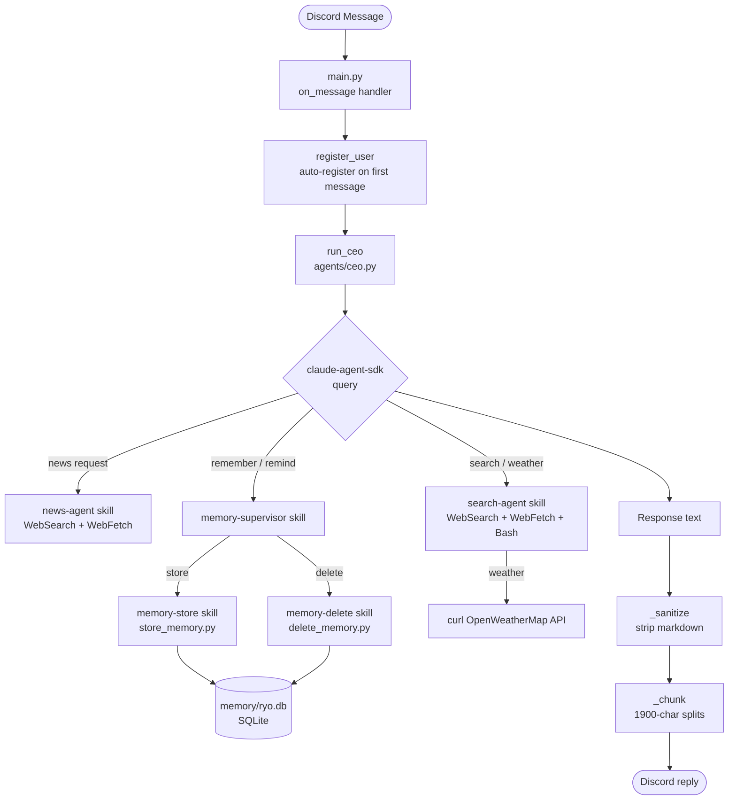
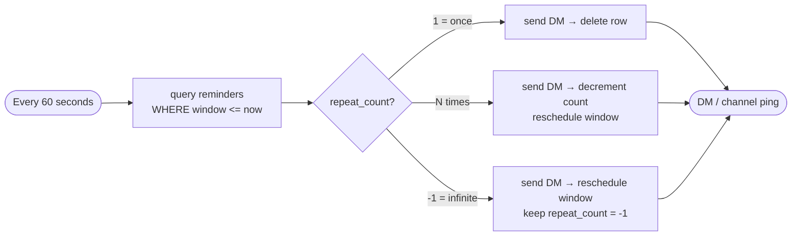
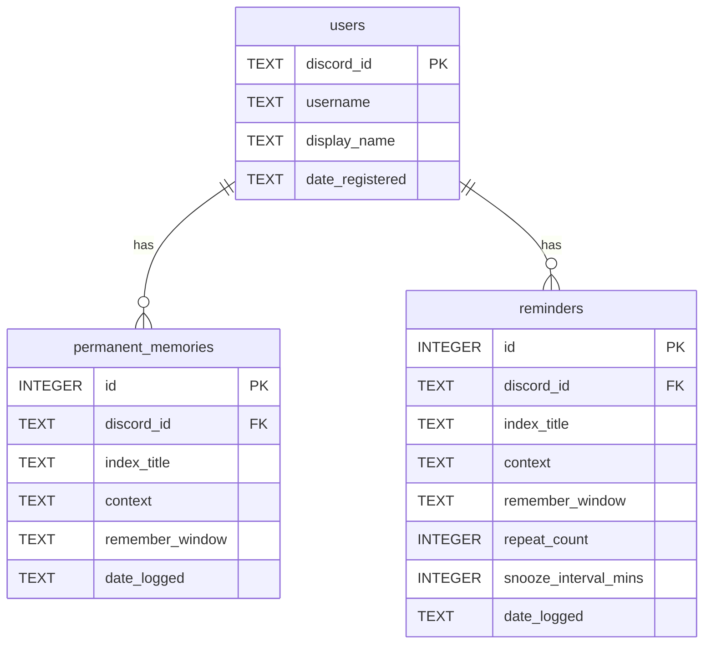

# RYO — Work in Balance. Life in Flow.

A hierarchical multi-agent Discord bot that helps you maintain work-life balance by managing news, web research, and personal memory — and proactively pings you when it matters.

---

## What RYO Can Do

| Capability | How to use it |
|---|---|
| **Personalized news** | "What's in the news?" — tailored to your saved preferences |
| **Web search** | "Find me info on X" / "Look up Y" |
| **Weather** | "What's the weather in Jersey City?" |
| **Permanent memory** | "Remember that I'm a VP at JPMorgan" |
| **Reminders** | "Remind me to submit my report by Friday" |
| **Repeat reminders** | "Remind me 3 times every 10 minutes" / "Keep reminding me until I say stop" |
| **Per-user profiles** | Each Discord user gets their own isolated memory |
| **Forget** | "Forget my address" / "Stop reminding me about X" |

---

## Architecture

### Request Flow


```mermaid
flowchart TD
    A([Discord Message]) --> B[main.py\non_message handler]
    B --> C[register_user\nauto-register on first message]
    C --> D[run_ceo\nagents/ceo.py]
    D --> E{claude-agent-sdk\nquery}

    E -->|news request| F[news-agent skill\nWebSearch + WebFetch]
    E -->|search / weather| G[search-agent skill\nWebSearch + WebFetch + Bash]
    E -->|remember / remind| H[memory-supervisor skill]
    H -->|store| I[memory-store skill\nstore_memory.py]
    H -->|delete| J[memory-delete skill\ndelete_memory.py]

    I --> K[(memory/ryo.db\nSQLite)]
    J --> K
    G -->|weather| L[curl OpenWeatherMap API]

    E --> M[Response text]
    M --> N[_sanitize\nstrip markdown]
    N --> O[_chunk\n1900-char splits]
    O --> P([Discord reply])
```

### Reminder Loop


```mermaid
flowchart LR
    T([Every 60 seconds]) --> Q[query reminders\nWHERE window <= now]
    Q --> R{repeat_count?}
    R -->|1 = once| S[send DM → delete row]
    R -->|N times| U[send DM → decrement count\nreschedule window]
    R -->|-1 = infinite| V[send DM → reschedule window\nkeep repeat_count = -1]
    S --> W([DM / channel ping])
    U --> W
    V --> W
```

### Memory Model


```mermaid
erDiagram
    users {
        TEXT discord_id PK
        TEXT username
        TEXT display_name
        TEXT date_registered
    }
    permanent_memories {
        INTEGER id PK
        TEXT discord_id FK
        TEXT index_title
        TEXT context
        TEXT remember_window
        TEXT date_logged
    }
    reminders {
        INTEGER id PK
        TEXT discord_id FK
        TEXT index_title
        TEXT context
        TEXT remember_window
        INTEGER repeat_count
        INTEGER snooze_interval_mins
        TEXT date_logged
    }
    users ||--o{ permanent_memories : has
    users ||--o{ reminders : has
```

---

## Skill Layout

```
.claude/skills/
├── news-agent/SKILL.md          ← headlines + links, 5-7 items
├── search-agent/SKILL.md        ← web facts + weather card
├── memory-supervisor/SKILL.md   ← routes store vs delete, asks repeat preference
├── memory-store/
│   ├── SKILL.md
│   └── scripts/store_memory.py  ← SQLite INSERT with repeat/snooze args
└── memory-delete/
    ├── SKILL.md
    └── scripts/delete_memory.py ← SQLite DELETE scoped to discord_id
```

Skills are auto-loaded by the Claude Agent SDK from `.claude/skills/` — no explicit registration needed.

---

## Setup

### 1. Environment

```bash
conda activate llm_env
pip install -r requirements.txt
```

### 2. `.env`

```
ANTHROPIC_API_KEY=""        # from console.anthropic.com (or leave blank if using Claude Code auth)
OPENWEATHERMAP_API_KEY=""   # from openweathermap.org
DISCORD_TOKEN=""            # from discord.com/developers
```

### 3. Database

```bash
python memory/setup_db.py
```

Safe to re-run — creates tables if missing and migrates any existing CSV data.

### 4. Run

```bash
python main.py
```

---

## Status

### Done
- Claude Agent SDK integration (`claude-sonnet-4-6`)
- Agent Skills for news, search, and memory
- Per-user memory with Discord ID scoping
- SQLite memory database with migration from CSV
- Reminder pinging with repeat / snooze support
- Discord-optimized response formatting
- Auto user registration on first message

### Roadmap
- Goal tracking (fitness, career, personal)
- Meal prep and food inventory management
- Gym routine tracking
- Proactive daily briefings
- Full beta release
